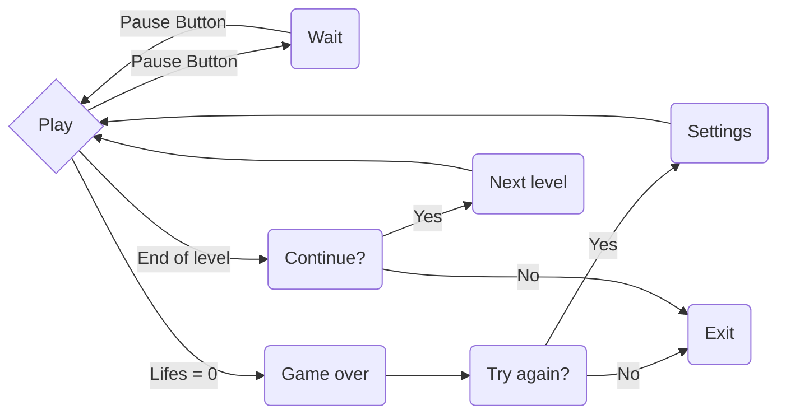

# Brick Breaker X-mas edition - Matrix game - @UnibucRobotics

## Description

**Brick Breaker** is a game in which the player must smash a wall of bricks by deflecting a bouncing ball with a paddle. The paddle moves horizontally and is controlled with a joystick. The player gets 3 lives to start with. When the ball is bounced up by the paddle, it will hit a brick and then the brick is gone. After that the ball will come down; if the paddle misses the ball, a life is lost. When all the bricks have been destroyed, the player advances to a new, harder level. If all lives are lost, the game is over.

>  **Power ups** implemented in X-mas edition: *the fire laser* (the player can shoot flaming fireballs using the joystick).

## Meeting the requirements

**Score**: initially the score is 0 and it increases with 5 for every brick destroyed. In addition, for every fireshot the score decreases with 5.

**Progress in difficulty**:

-  *level difficulty*: the complexity of the game increases from one level to another as the layout of the bricks changes.

-  *speed increase*: transition to a faster speed occurs after a number of balls were destroyed (multiple of 5) until the max speed is reached.
  
**2 requirements of choice**:

-  **Levels**: 4 levels with different bricks layouts

-  **Lives**:  at the beginning of every level the number of lives is 3. The number is decreased with one when the paddle misses the bouncing ball.

## Hardware components

- 8x8 LED matrix

- LCD

- Joystick

- MAX7219 Driver

- active buzzer

## How to play instructions

Before playing, make sure that you entered the Settings menu and set your name accordingly (otherwise you will be just another "anonim"). You can also chose the starting level, but take note that the score associated with the levels you passed will be 0 and this can reduce your chances to obtain a better score and, consequently, to do a high score. 

After all settings have been made, the game can start. Use the joystick to move the paddle accordingly. You can also shoot flaming fireballs by pressing the button of the joystick, but be careful not to kill yourself.

## Game logic

## Picture

## Demo video
