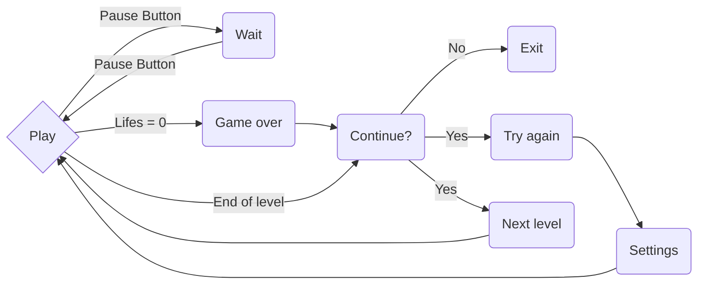

# Brick Breaker X-mas edition - Matrix game - @UnibucRobotics

## Description

**Brick Breaker** is a game in which the player must smash a wall of bricks by deflecting a bouncing ball with a paddle. The paddle moves horizontally and is controlled with a joystick. The player gets 3 lives to start with. When the ball is bounced up by the paddle, it will hit a brick and then the brick is gone. After that the ball will come down; if the paddle misses the ball, a life is lost. When all the bricks have been destroyed, the player advances to a new, harder level. If all lives are lost, the game is over.

>  **Power ups** implemented in X-mas edition: *the magnet* (the ball remains on the paddle and is released when the player press a special button), *the paddle grow*, *the fire laser* (the player can shoot flaming fireballs), the ball multiplication (the player can play with more than one ball), *rescue* (increase the number of lives).

_To add only if time allows: unbreakable bricks and bricks that can only be destroyed by a number of hits_

  

## Meeting the requirements

**Score**: initially the score is 0 and it increases with 5 for every brick destroyed

**Progress in difficulty**:

-  *level difficulty*: the complexity of the game increases from one level to another as the layout of the bricks changes

-  *speed increase*: transition to a faster speed occurs after the ball makes a certain number of bounces off the bricks and walls until the max speed is reached. If the player loses a life, the cycle will repeat itself: the ball will start slow, then speed up.

>  _To add only if time allows: after reaching the max speed the bricks blocks will start to descend (up to level 5 of the matrix) every time the paddle makes contact with the ball_

  
**2 requirements of choice**:

-  **Levels**: 4 levels with different bricks layouts

-  **Lives**:  at the beginning of every level the number of lives is 3. The number is decreased with one when the paddle misses the bouncing ball and it is increased with one if a rescue power up reaches the paddle. 

## Hardware components

- 8x8 LED matrix

- LCD

- Joystick

- MAX7219 Driver

- 3 buttons: pause button, release button, shoot button

- buzzers (for music)

- LED-s (for animation purposes)

- _To add if any idea comes and time allows: 7 segment display (displaying clock time or playing time)

## How to play instructions

  

## Game logic

## Picture

## Demo video
